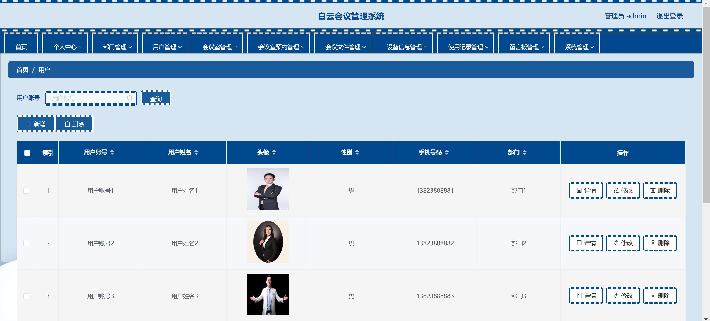

<h1 align="center">会议厅预约管理系统</h1>

## 简介
会议厅预约管理系统：角色分为管理员、用户；包括个人中心、部门管理、用户管理、会议室管理、预约管理、设备管理、使用记录、留言板功能，实现高效会议安排。    --计算机毕业设计源码；毕设源码；java毕业设计源码

## 联系方式

<h3 align="center">获取完整代码与数据库文件 + 微信：bysj5151 QQ: 86050149 QQ群: 783742310</h3>

<h3 align="center">可帮忙远程部署 包运行成功！提供远程部署、修改代码、设计文档指导、代码讲解等服务！</h3>

## 功能介绍（完整见运行截图）
管理员：负责管理系统的各个模块，包括会议室管理、用户管理、设备信息管理和系统设置。能够进行查询、修改、删除及批量操作，确保会议室和设备信息更新及时，用户数据安全管理，以及系统后台的稳定运行。具有最高权限，可以访问并管理系统的所有功能模块。

用户：可以通过系统进行会议室的预约、查看公告信息、留言及个人信息管理。能够上传头像、更新个人资料，通过界面选择所需日期和时间段预约会议室，并查看和管理自己的预约记录。用户在个人中心可以查看和修改自己的信息，确保联系方式更新准确与预约管理便捷。

会议室管理员：负责管理和维护会议室信息，包括查看会议室状态，更新会议室详情，及预约管理。确保会议室信息的准确和资源的合理分配，处理用户的预约申请，及提供相关的会议信息咨询服务，提升会议室使用效率和用户满意度。

技术支持：负责系统的技术维护和支持，确保系统的正常运行和应对突发技术问题。提供技术咨询和支持服务，以解决管理员和用户在使用系统中遇到的问题，协助进行系统更新和功能优化，保障系统的安全性和可靠性。

## 运行截图

本代码来源于网络,仅供学习参考使用!

